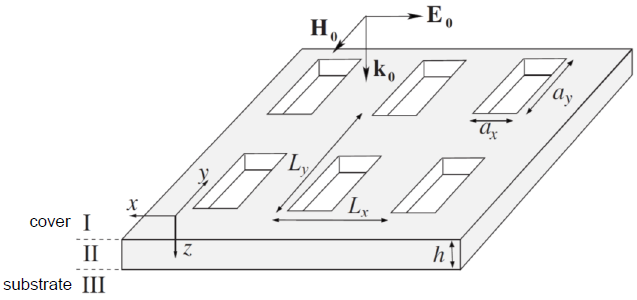

*IrisME* 
============
This file is part of *IrisME*, a software for the calculation of scattering coefficients in arrays of rectangular holes perforating a metal film. IrisME is based on the Modal Expansion (ME) of the electromagnetic fields (see below). 

*IrisME* is licensed under the AGPL and it is free to use. However, if you use IrisME in a work that leads to a scientific or academic publication, we would appreciate it if you would kindly cite *IrisME* in your manuscript:

> L. Martín-Moreno, F.J. García-Vidal, *Minimal model for
> optical transmission through holey metal films*, J. Phys.:
> Condens. Matter 20, 304214 (2008) *and*
> S.G. Rodrigo,*Terahertz gas sensor 
> based on absorption-induced transparency*, 
> EPJ Applied Metamaterials 3, 11 (2016).

**Important:** This program is free to use. However, if you are using, or plan to use it, specially if it is for research or academic purposes, please send an email with your name, institution and a brief description of your interest for this program. Commercial applications may also acquire a commercial license. Please contact <sergut@unizar.es> & <lmm@unizar.es>, for details.      

Copyright (C) 2019 Sergio G Rodrigo <sergut@unizar.es> & Luis Martin-Moreno <lmm@unizar.es>

IrisME is free software: you can redistribute it and/or modify it under the terms of the GNU Affero General Public License as published by the Free Software Foundation, either version 3 of the License,or (at your option) any later version.
  
IrisME is distributed in the hope that it will be useful for research or/and academic purpouses, but WITHOUT ANY WARRANTY; without even the implied warranty of MERCHANTABILITY or FITNESS FOR A PARTICULAR PURPOSE. See the GNU Affero General Public License for more details. You should have received a copy of the GNU Affero General Public License along with IrisME. If not,see <http://www.gnu.org/licenses/>.

***

*Modal expansion (briefly)* 
--------------------------------

*IrisME* is a good tool to obtain fast and accurate results calculating scattering coefficients in Perfect Electric Conductor rectangular hole arrays, as compared to other numerical models widely used in computational electromagnetism.

Within ME, Maxwells equations are solved by expanding the EM fields in the different regions of space, transmission and reflection coefficients are thus calculated by imposing appropriate boundary conditions (see Ref. [1], and references therein). The whole space is divided in three regions: (I) the substrate, (II) holes and, (III) the superstrate. In region (I) the EM field is expanded in terms of TE and TM waveguide eigenmodes. However, good convergence is attained for many problems only by considering the less decaying transversal electric mode, $TE_{0,1}$ for subwavelength rectangular holes (the fundamental waveguide mode). Within this minimal model, results can be worked out analytically.  

 *References:*
 
[1] F.J. Garcia-Vidal, L. Martin-Moreno, T.W. Ebbesen, L. Kuipers, *Light passing through subwavelength apertures*, Rev. Mod.
Phys. 82, 729–787 (2010).

[2] L. Martín-Moreno, F.J. García-Vidal, *Minimal model for
optical transmission through holey metal films*, J. Phys.:
Condens. Matter 20, 304214 (2008).

[3] S.G. Rodrigo,*Terahertz gas sensor based on absorption-induced transparency*, EPJ Applied Metamaterials 3, 11 (2016).

[4] S. Carretero-Palacios, F. J. García-Vidal, L. Martín-Moreno, and 
S. G. Rodrigo *Effect of film thickness and dielectric environment on optical transmission through subwavelength holes*,
Phys. Rev. B 85, 035417 (2012).

***

IrisME (the programs) 
--------------------------------

**Getting and installing *IrisME***

The library can be download from: <https://github.com/IrisFDTD/IrisME>

Two different implementations of ME are made available:

1. **IrisME** is a Wolfram Mathematica (C) script for the calculation of scattering coefficients from arrays of rectangular holes in metals. The metal is approximated as a Perfect Electric Conductor ( $|𝜀_{𝑚𝑒𝑡𝑎𝑙}|=∞$ ), which is a good approximation in the THz regime for geometrical features much larger than the skin depth. A brief description of the method can be found in the Appendix of Ref. [3]. The formalism is based on the amplitudes of the electric field at the openings (see Ref. [2], for further details). This version has been checked to work from Mahtematica 8.0 version.

2. **IrisMEadv** is a program written in Fortran with extended capabilities: additional EM modes inside the holes, realistic optical properties of the metals under the Suface Impedance Boundary Conditions (SIBC), multiple scattering formalism (see Ref. [2], for further details),... If you are interested in these add-ons contact to Sergio G Rodrigo <sergut@unizar.es> & Luis Martin-Moreno <lmm@unizar.es>. IrisMEadv32_Windows and IrisMEadv64_Linux are versions for Windows and Linux, respectively.

Also included with this realease an example is provided (**IrisME.jpynb**).

***
- - -

+ **Example 1:**

In this example we show how to obtain both transmission and reflection of terahertz waves through a hole array. The period is $p_x=p_y=400 \mu$m, and the rectangles have $a_x = 10 \mu$m and  $a_y = 350 \mu$m sides.  The holes are in a thin PEC screen of $h = 25 \mu$m and filled with $\epsilon_{II} = 4$. The cover and substrate dielectric constants are the equal, $\epsilon_{I}= \epsilon_{III}= 2$.  Light iluminates the structure at normal incidence with the electric field polarized along the x-axis.

The result for transmission can be compared to Figure 7-(top) in [4].

**Steps:**
1. Run IrisME.nb, included in this version at the same directory this script in launched. Mathematica has to be installed (from 8.0 version). IrisME.dat contains the geometrical and rest of parameters for IrisME.nb. The output file, T-R_IrisME.dat, has 3 columns of data: wavelengths ( $\mu$ m), transmission and reflection.

2. Run the Python script below. This script calls IrisMEAdv32_Windows.exe (Windows) and IrisMEAdv64_Linux.exe (Linux), included in this release of the program.  IrisMEadv.dat contais the geometrical and rest of parameters for IrisMEadv. The output file of IrisMEAdv T-R_IrisMEadv.dat, has 3 columns of data: wavelengths ($\mu$ m), transmission and reflection. The Python script finally plots all the outputs in the same figure.
    
    
    
***
- - -
