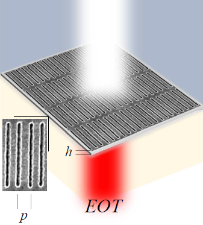

Copyright (C) 2019 Sergio G Rodrigo <sergut@unizar.es> & Luis Martin-Moreno <lmm@unizar.es>

**Important:** 
*IrisME* is licensed under the AGPL and it is free to use. if you are using, or plan to use this example, specially if it is for research or academic purposes, please send an email with your name, institution and a brief description of your interest for this program.  If you use this example of *IrisME* in a work that leads to a scientific or academic publication, we would appreciate it if you would kindly cite Refs. [1,4-5]  in your manuscript (see below).

***
- - -

> **Example 1: Extraordinary Optical Transmission**

This example is extracted from Ref. [1]. The results of transmission spectrum calculated can be compared with one of the cases in **Figure 1.12** (note that only the zeroth-order is plotted in this figure). This figure illustrates the phenomenon of Extraordinary Optical Tranmission (EOT), a family of electromagnetic resonances through subwavelength apertures, in either a flat or a corrugated metallic film. These resonances provide high transmission of light, much more that would be expected for such tiny apertures as compared to the wavelength of light [2]. EOT was discovered in 1998 [3] and since then, it has been a very active research field [4], leading both to the discovery of new ways of enhancing the optical transmission and to its application to sensing, color filters, metamaterials, lenses, optical trapping, enhancement of nonlinear effects, among others [5]. 

**Description:**

This example shows you how to obtain a transmission spectrum through an array of square holes ($L_x=L_y=500$nm, $a_x=a_y=250$nm and $h=200$nm) drilled on a free-standing film. The metal film is approximated as a perfect electric conductor.  The range of energies represented are in the visible range. Note however that these results are only qualitatively correct in the optical regime.  Light iluminates the structure at normal incidence, being the electric field polarized along the x direction. 

**Steps:**
1. Run IrisME.nb, included in this version, at the same directory this script in launched. The file input_IrisME.dat contains the geometrical and rest of parameters for IrisME.nb. The output file T-R_IrisME.dat has 3 data columns: wavelengths (nm), transmission and reflection. Mathematica has to be installed (from 8.0 version). If not, you will still use IrisMEadv. 

2. Run the iPython script. The script calls the IrisMEAdv 64-bits executable for Windows/Linux, included in this release.  The file Input_IrisMEadv.dat contais the geometrical and rest of parameters for IrisMEadv. The output file is T-R_IrisMEadv.dat, which contains 3 data columns: wavelengths (nm), transmission and reflection. The Python script finally plots all the outputs in a figure. Note that you can alternatively run IrsMEAdv programs in from the console.

   
*References:*
 
[1]  Sergio G. Rodrigo, [*Optical Properties of Nanostructured Metallic Systems: Studied with the Finite-Difference Time-Domain Method*](https://www.springer.com/gp/book/9783642230844), Springer-Verlag, Berlin, (2012).

[2] H. A. Bethe, [*Theory of difraction by small holes*](https://journals.aps.org/pr/abstract/10.1103/PhysRev.66.163), Phys. Rev. 66, 163–182 (1944).

[3] T. W. Ebbesen, H. L. Lezec, H. F. Ghaemi, T. Thio, and P. A. Wolff, [*Extraordinary optical transmission through subwavelength hole arrays*](https://www.nature.com/articles/35570), Nature 391, 667–669 (1998).

[4] F.J. Garcia-Vidal, L. Martin-Moreno, T.W. Ebbesen, L. Kuipers, [*Light passing through subwavelength apertures*](https://journals.aps.org/rmp/abstract/10.1103/RevModPhys.82.729), Rev. Mod. Phys. 82, 729–787 (2010).

[5] S.G. Rodrigo, F. de León-Pérez, and L. Martín-Moreno, [*Extraordinary Optical Transmission: fundamentals and applications*](https://ieeexplore.ieee.org/document/7592449), Proceedings of the IEEE 104, 2288 (2016). 
    
***
- - -