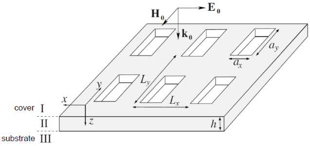

Copyright (C) 2019 Sergio G Rodrigo <sergut@unizar.es> & Luis Martin-Moreno <lmm@unizar.es>

**Important:** 
*IrisME* is licensed under the AGPL and it is free to use. if you are using, or plan to use this example, specially if it is for research or academic purposes, please send an email with your name, institution and a brief description of your interest for this program.  If you use this example of *IrisME* in a work that leads to a scientific or academic publication, we would appreciate it if you would kindly cite Refs. [1-4]  in your manuscript (see below).

***
- - -

> **Example 3: Absoption Induced Transparency**

The following example is extracted from Ref. [1]. The calculated transmission spectrum can be compared with the blue curve in **Fig.2 (a-b)**. This example shows that the optical response of a metallic grating suddenly changes when an absorbing medium, typically characterized by absorbtion lines (e.g. HCN), is present. Contrary to what might be expected, when a such an absorber is sputtered onto an opaque holey metal film, transmission and reflection bands can be observed at the absorption energies of the absorber. This phenomenon, known as absorption-induced transparency (AIT), is aided by a strong modification of the propagation properties of light inside the holes when filled by the absorber [3], but not less important, by surface modes [4]. Despite having been initially observed in metallic structures in the optical regime [4], new routes for investigation and applications at different spectral regimes can be devised like the one of the example,  which illustrates a method for molecular detection in the GHz regime. 

**Description:**
You can calculate with *IrisME*  transmission and reflection spectra through metallic hole arrays in the presence of an absorber. In this example, a hole array perforating a perfect electric conductor metal screen is in contact with Hydrogen Cyanide (HCN). The HCN is "released" only inside the holes. The hole array, made of rectangular holes ($a_x=50.0\,\mu \text{m}, a_y=120.9\,\mu \text{m}$), is arranged in a rectangular lattice ($L_x=80\,\mu \text{m}$, $L_y=150\,\mu \text{m}$) and milled in a $1.0 \, \text{mm}$ thick metal film. The THz source is aligned so the system is illuminated at normal incidence from the cover side, which is transparent Teflon ($\varepsilon_{Teflon}=2.06$). The electric field points along the x-direction. 

HCN is exhaled by motor vehicles, and it is also present in tobacco in low concentrations beind extensively used in industry and manufacturing. Out of its multiple absorption resonances at THz, one is spectrally located at $1239.89$ GHz, a narrow line with a full-width at half-maximum $\approx 126$ MHz. The contribution to the dielectric constant of HCN from this absorption line can be represented by a Lorentz function, namely, $\varepsilon_{\text{HCN}}(\nu)=\varepsilon_{r} - \Delta \varepsilon \, \Omega^2/(\nu^2-\Omega^2+\imath \nu \Gamma)$.  In this example $\varepsilon_{r}=1.0$, $\Delta \varepsilon \approx 3.5 \times 10^{-6}$, $\Gamma=96.79$ GHz, and  $\Omega=1239.89$ GHz for a HCN concentration of $\approx 2.07 \times 10^5$ ppm. Note that $\Gamma$ and $\Omega$ are given in $meV$ in input_IrisME.dat, neccesary for *IrisME* properly works.

**Steps:**
1. Run IrisME.nb, included in this version, at the same directory this script in launched. The file input_IrisME.dat contains the geometrical and rest of parameters for IrisME.nb. The output file T-R_IrisME.dat has 3 data columns: wavelengths ( $\mu$m), transmission and reflection. Mathematica has to be installed (from 8.0 version). Run Python script to visualize the results.
    
*References:*

[1] S.G. Rodrigo, and L. Martín-Moreno, [*Absorption-induced transparency metamaterials in the terahertz regime*](https://www.osapublishing.org/ol/abstract.cfm?uri=ol-41-2-293), Opt.  Lett. 41, 293-296 (2016).

[2] S.G. Rodrigo, [*Terahertz gas sensor based on absorption-induced transparency*](https://epjam.edp-open.org/articles/epjam/full_html/2016/01/epjam160014/epjam160014.html), EPJ Applied Metamaterials 3, 11 (2016).

[3] S.G. Rodrigo, F. J. García-Vidal, and L. Martín-Moreno, [*Theory of absorption-Induced transparency*](https://journals.aps.org/prb/abstract/10.1103/PhysRevB.88.155126), Phys. Rev. B 88, 155126 (2013).

[4] X.Zhong, S.G. Rodrigo, L. Zhang, P. Samorì, C. Genet, L. Martín-Moreno, J.A. Hutchison, and T.W. Ebbesen, [*Waveguide and Plasmonic Absorption-Induced Transparency*](https://pubs.acs.org/doi/abs/10.1021/acsnano.6b00709)*, ACS Nano 10, 4570-4578 (2016).

    
***
- - -
